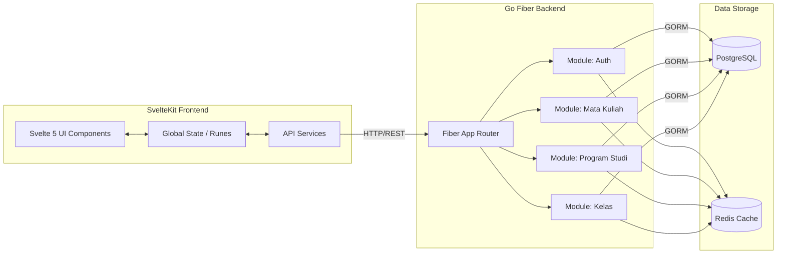
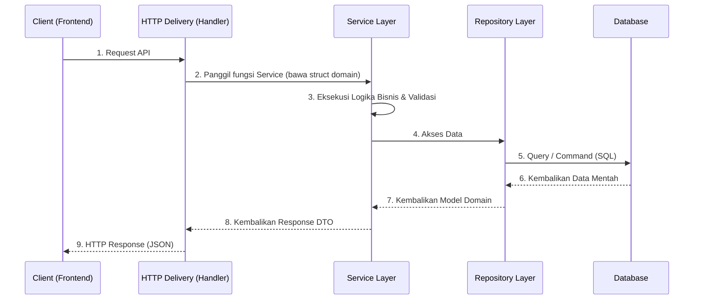

# SIAKAD Pro System

Sebuah sistem terintegrasi dengan arsitektur **SIAKAD Pro**, dikembangkan menggunakan **Go (Fiber)** di sisi backend dan **SvelteKit (Svelte 5 Runes)** di sisi frontend. Proyek ini dirancang untuk memberikan performa yang tinggi, struktur kode yang bersih, serta desain antarmuka pengguna (UI) modern berbasis *Glassmorphism*.

## 🚀 Fitur Utama

- **Modular Architecture**: Struktur backend dibagi berdasarkan modul (`auth`, `matakuliah`, `kelas`, `programstudi`) yang membuat kode lebih terisolasi dan mudah di-maintain. Setiap modul mengikuti pola **Clean Architecture** dengan 4 lapisan: `domain`, `repository`, `service`, dan `delivery/http`.
- **Frontend Modular Design**: Pemisahan antarmuka (UI) menjadi komponen-komponen terisolasi di `src/lib/components` dipadukan dengan manajemen *Global State* Svelte 5 Runes untuk optimasi reaktivitas dan caching data.
- **Modern Authentication**: Implementasi JWT (JSON Web Token) dengan kapabilitas *Role-based Access Control* (RBAC).
- **Custom Performance Logger**: Middleware khusus untuk mengukur latensi eksekusi setiap request API, dikategorikan secara *real-time* ke dalam tiga level: `FAST`, `MODERATE`, dan `SLOW`.
- **Role-based Dashboards**: Tampilan dashboard spesifik untuk masing-masing role dengan tata letak (layout) grid 2-kolom yang elegan. Sidebar menggunakan antarmuka *Glassmorphism* modern dengan ikon vektor (SVG) profesional.
- **Admin Management**: Fitur khusus bagi admin untuk mendaftarkan akun baru (seperti akun dosen), mengelola **Permintaan Ganti Email** (Request Email), serta meninjau dan menyetujui/menolak **Pengajuan Mata Kuliah** dari dosen.
- **Manajemen Kelas Dinamis**: Mendukung pembuatan jadwal kelas (*Multi-schedule*) yang fleksibel. Satu ruangan kelas fisik dapat digunakan untuk hari dan jam yang berbeda dengan sistem proteksi *conflict* (jadwal ganda) terintegrasi, serta tabel UI canggih yang secara otomatis dikelompokkan berdasarkan Program Studi, lengkap dengan fitur pencarian dan pengurutan (jam/hari/nama kelas).
- **Sistem Pengajuan Mata Kuliah**: Dosen dapat mengajukan permintaan untuk mengampu mata kuliah. Admin meninjau dan memberikan keputusan (*approve/reject*).
- **Sistem Pengajuan Kelas & Validasi Jadwal**: Setelah memiliki mata kuliah, dosen dapat memilih dan mengajukan kelas fisik yang ingin diajar. Sistem memvalidasi kesesuaian Program Studi, mencegah bentrok jadwal kelas bagi dosen yang sama, dan membatasi jumlah kelas sesuai jumlah mata kuliah yang diampu.
- **Portal Kelas & Sistem Absensi**: Dosen yang telah disetujui untuk mengajar kelas tertentu mendapatkan akses fitur "Masuk Kelas". Di dalamnya, terdapat fitur **Manajemen Pertemuan Terpusat** (termasuk auto-increment nomor pertemuan hingga maksimal 16) yang terintegrasi secara otomatis dengan sistem pembuatan **Kode Absensi 6-digit** dan **Rekap Kehadiran Mahasiswa**. Portal ini juga dilengkapi *placeholder* fitur e-learning: Daftar Mahasiswa, Materi, Tugas, dan Pengumuman.
- **Manajemen Program Studi**: Modul khusus untuk mengelola data Program Studi yang terintegrasi dengan modul Kelas dan Mata Kuliah.
- **Sistem Profil & Keamanan**: Halaman profil terdedikasi (`/dashboard/profile`). Data vital seperti Nomor Induk Dosen (NID) bersifat permanen (tidak bisa diubah/dihapus), dan penggantian email memerlukan _approval_ Admin. Pengguna juga dapat mengunggah **Foto Profil** yang otomatis di-_crop_ (rasio 1:1) dan akan ditampilkan pada *Navbar* serta tabel antarmuka lintas-role secara publik (misal pada Daftar Akun Dosen).
- **Laporan & Evaluasi Akademik**: Halaman khusus Admin (`/dashboard/evaluasi`) yang merangkum data krusial: Mata Kuliah yang belum memiliki dosen pengampu, Dosen yang belum mengampu mata kuliah sama sekali, serta Kelas yang belum terutilisasi.
- **Visualisasi Indikator Prodi**: Pada daftar Mata Kuliah, terdapat _Badge_ indikator visual cerdas ("Sesuai Prodi" vs "Lintas Jurusan") untuk mengetahui apakah dosen pengampu mengajar sesuai asal jurusannya atau tidak.
- **Toast Notification System**: Sistem notifikasi *toast* global berbasis Svelte 5 Runes (`$state`) dengan dukungan tipe `success`, `error`, dan `info` serta *auto-dismiss* otomatis.
- **Reusable UI Component Library**: Komponen antarmuka siap pakai (`Badge`, `Card`, `Modal`, `Toast`) yang terletak di `src/lib/components/ui` untuk menjaga konsistensi desain di seluruh aplikasi.
- **Svelte 5 Runes**: Memanfaatkan fitur *reactivity* modern dari Svelte 5 (`$state`, `$derived`) yang membuat manajemen *state* frontend lebih efisien.
- **Database & Cache**: Terhubung dengan **PostgreSQL** (melalui GORM) untuk database persisten dan **Redis** untuk manajemen *cache*.
- **Swagger Documentation**: Dokumentasi endpoint API otomatis yang dapat diakses dengan mudah untuk kebutuhan *development*.

---

## 🏗️ Arsitektur Sistem

Sistem ini didesain menggunakan pola **SIAKAD Pro** dengan interaksi Frontend-Backend secara asinkron.



---

## 🏆 Quality Attributes

Sistem ini dibangun dengan memprioritaskan NFR (Non-Functional Requirements) berikut:
- **Maintainability (Keterpeliharaan)**: Diwujudkan melalui pemisahan domain pada *backend* (SIAKAD Pro dengan Clean Architecture: `domain` → `repository` → `service` → `delivery/http`) dan pemisahan komponen secara atomik pada *frontend* (SvelteKit).
- **Performance (Kinerja)**: Backend Go Fiber sangat cepat dalam menangani *request* HTTP, didukung dengan *caching* Redis, serta manajemen *state* reaktif menggunakan *Runes* pada Svelte 5.
- **Security (Keamanan)**: Diimplementasikan menggunakan autentikasi *stateless* (JWT), enkripsi *password* menggunakan Bcrypt, dan sistem RBAC (Role-Based Access Control) yang ketat di level API maupun UI.
- **Usability (Kebergunaan)**: Pengalaman antarmuka (*User Experience*) difokuskan dengan desain visual *Glassmorphism*, transisi antar halaman instan (*Single Page Application* feel), notifikasi *toast* yang informatif, serta *feedback* yang responsif.
- **Scalability (Skalabilitas)**: Arsitektur *stateless* memungkinkan aplikasi untuk mudah di-*scale* (dikembangkan) ke depannya, baik dari sisi fungsionalitas (menambah modul baru) maupun dari sisi infrastruktur (menambah *instance* server).

---

## 🛠️ Tech Stack

### Backend
- **Language**: Go (Golang)
- **Framework**: Go Fiber (v2)
- **ORM**: GORM
- **Database**: PostgreSQL
- **Cache**: Redis
- **Security**: JWT & Bcrypt
- **API Docs**: Swagger (Swaggo)

### Frontend
- **Framework**: SvelteKit (Svelte 5)
- **Styling**: Vanilla CSS (Glassmorphism & Modern Animations)
- **Build Tool**: Vite

---

## 📂 Struktur Proyek

```text
📦 Project Root
 ┣ 📂 cmd/api              # Main entry point aplikasi Go
 ┣ 📂 config               # Konfigurasi environment (DB, Redis, JWT)
 ┣ 📂 docs                 # Dokumentasi auto-generated (Swagger)
 ┣ 📂 frontend             # Direktori frontend SvelteKit
 ┃  ┣ 📂 src/lib
 ┃  ┃  ┣ 📂 components
 ┃  ┃  ┃  ┣ 📂 dashboard   # Komponen halaman dashboard (13 komponen)
 ┃  ┃  ┃  ┣ 📂 splash      # Komponen splash screen (Admin & Default)
 ┃  ┃  ┃  ┗ 📂 ui          # Komponen reusable (Badge, Card, Modal, Toast)
 ┃  ┃  ┣ 📂 services       # API Service layer (auth, kelas, matakuliah, dosen, programstudi)
 ┃  ┃  ┣ 📂 stores         # Global State Svelte 5 Runes (auth, toast)
 ┃  ┃  ┗ 📜 types.ts       # TypeScript type definitions
 ┃  ┣ 📂 src/routes
 ┃  ┃  ┣ 📂 dashboard      # Halaman dashboard dengan layout sidebar
 ┃  ┃  ┃  ┣ 📂 dosen       # Halaman manajemen dosen
 ┃  ┃  ┃  ┣ 📂 kelas       # Halaman manajemen kelas
 ┃  ┃  ┃  ┣ 📂 matakuliah  # Halaman manajemen mata kuliah
 ┃  ┃  ┃  ┗ 📂 profile     # Halaman profil pengguna
 ┃  ┃  ┗ 📂 login          # Halaman login
 ┃  ┗ 📜 app.css           # File core CSS dengan variable desain
 ┣ 📂 internal             # Core logic dari backend SIAKAD Pro
 ┃  ┣ 📂 app               # Registrasi aplikasi dan middleware (Fiber)
 ┃  ┣ 📂 modules           # Modul domain (masing-masing berisi 4 lapisan Clean Architecture)
 ┃  ┃  ┣ 📂 auth           # Modul autentikasi & manajemen pengguna
 ┃  ┃  ┣ 📂 kelas          # Modul manajemen kelas & jadwal
 ┃  ┃  ┣ 📂 matakuliah     # Modul manajemen mata kuliah & pengajuan
 ┃  ┃  ┗ 📂 programstudi   # Modul manajemen program studi
 ┃  ┗ 📂 shared            # Logic shared antar module (DB, Cache, Error Handler, Middleware, Response)
 ┗ 📜 README.md
```

### Arsitektur Setiap Modul Backend (Clean Architecture)

```text
📂 modules/<nama_modul>
 ┣ 📂 domain              # Entitas, struct, dan interface (kontrak kerja)
 ┣ 📂 repository          # Implementasi akses database (GORM/PostgreSQL)
 ┣ 📂 service             # Logika bisnis dan validasi
 ┗ 📂 delivery/http       # Handler HTTP dan routing (Fiber)
```

**Alur Aliran Data (Data Flow):**


---

## ⚖️ Aturan Bisnis (Business Rules)

Berikut adalah visualisasi aturan dan alur bisnis utama dalam platform ini:


---

## 🏗️ Konstruksi Perangkat Lunak (Software Construction)

Proses pengembangan dan perancangan aplikasi **SIAKAD Pro** ini mematuhi standar *Software Construction* modern untuk menghasilkan sistem yang tangguh, mudah dipelihara (*maintainable*), dan berkinerja tinggi.

### 1. Praktik Pemrograman (Coding Practices)
- **Clean Architecture**: Seluruh *backend* mematuhi pembagian lapisan yang ketat (`domain`, `repository`, `service`, `delivery/http`). Lapisan bisnis (*service*) tidak bergantung pada implementasi database (*repository*), melainkan berkomunikasi melalui *interface*. Hal ini memudahkan *Unit Testing*.
- **State Management Deklaratif (Svelte 5 Runes)**: Pada *frontend*, alih-alih memanipulasi DOM secara manual, pengelolaan data dilakukan secara reaktif menggunakan fitur Svelte 5 Runes (`$state`, `$derived`, `$effect`). Perubahan data di *stores* otomatis memicu render ulang secara parsial dan efisien pada UI (tanpa konsep *Virtual DOM* yang berat).
- **Global Error & Response Handling**: Backend menggunakan *middleware* untuk standardisasi respon API, sehingga error (baik sistemik maupun *business logic*) selalu dikembalikan dalam format struktur JSON standar (memuat field `success`, `message`, `data`).

### 2. Standar Antarmuka & Eksekusi CSS (Aesthetics & Performance)
- **Edge-to-Edge Minimalist**: Menghindari properti berat seperti `backdrop-filter` atau berlapis bayangan (shadow) demi performa render *browser* maksimal (tanpa nge-lag). Komponen-komponen merentang secara *fluid* sebesar 100% menggunakan *CSS Flexbox*.
- **No-Comment Policy**: Keseluruhan basis kode telah dioptimasi dengan menghapus komentar bawaan (developer comments) secara total setelah logika teruji dengan stabil. Ini memperkecil ukuran *file* mentah (*source code footprint*) dan meningkatkan keterbacaan murni (*clean code*).

### 3. Otomatisasi & Pengelolaan Basis Data (Data Integrity)
- **Auto Migration & Seeding**: Saat aplikasi backend pertama kali berjalan, GORM bertugas memeriksa struktur tabel di PostgreSQL dan menyesuaikannya (*Auto-migrate*). Skema *database* tidak memerlukan modifikasi manual di terminal SQL, melainkan cukup mendefinisikan *struct* `domain` di Golang.
- **Transaksional (ACID Compliance)**: Aksi krusial yang melibatkan perubahan berlapis dalam satu waktu dijaga secara transaksional di level *repository* (misal: pendaftaran mata kuliah ke kelas) untuk mencegah anomali data jika terjadi kendala putus koneksi di tengah-tengah pemrosesan.
- **Single Source of Truth**: Menghilangkan redudansi data (*data duplication*) dengan memusatkan kendali tabel yang saling terkait ke dalam modul dominannya (misal: penggabungan entitas Pertemuan dan Absensi secara eksklusif ke dalam modul Kelas), sehingga riwayat *database* tetap konsisten dan akurat.

---

## 💻 Cara Menjalankan Aplikasi (Local Development)

### 1. Persyaratan Sistem
Pastikan sistem Anda telah menginstall:
- Go (v1.20+)
- Node.js (v18+)
- PostgreSQL (berjalan di port default 5432)
- Redis (berjalan di port default 6379)

### 2. Konfigurasi Environment Backend
Buat file `.env` di *root directory* atau sesuaikan variabel yang ada di dalam `config/config.go`:
```env
PORT=8080
ENV=development

DB_HOST=localhost
DB_PORT=5432
DB_USER=postgres
DB_PASSWORD=postgres
DB_NAME=postgres
DB_SSLMODE=disable

REDIS_HOST=localhost
REDIS_PORT=6379
REDIS_PASSWORD=
REDIS_DB=0

JWT_SECRET=supersecret-jwt-key
```

### 3. Menjalankan Backend (Go)
Buka terminal di *root directory* dan jalankan perintah:
```bash
go run cmd/api/main.go
```
*Backend akan berjalan di `http://localhost:8080`*

*(Opsional) Jika ingin melihat dokumentasi Swagger, akses: `http://localhost:8080/api/v1/swagger/`*

### 4. Menjalankan Frontend (SvelteKit)
Buka terminal baru, masuk ke direktori `frontend`, lakukan instalasi dependensi, lalu jalankan development server:
```bash
cd frontend
npm install
npm run dev
```
*Frontend akan berjalan di `http://localhost:5173`*

---

## 🚦 Flow Aplikasi (Login to Dashboard)

1. **Akses**: Pengguna membuka `http://localhost:5173/login`.
2. **Autentikasi**: Pengguna memasukkan Email dan Password.
3. **Validasi**: Data dikirim ke API `/api/v1/auth/login`. Jika sukses, Backend mengembalikan JWT dan *Role* (Admin/User).
4. **Performa**: Secara bersamaan di console backend, performa request akan dilog (`FAST` / `MODERATE` / `SLOW`). Di console browser, tercatat latensi dari sisi klien.
5. **Splash Screen**: Frontend menyimpan token dan role ke Global Store memory dan langsung memunculkan Splash Screen dinamis (*Admin Splash* atau *Default Splash*).
6. **Redirect**: Setelah simulasi *loading* animasi (1.5 detik), pengguna otomatis diarahkan ke `http://localhost:5173/dashboard`.
7. **Dashboard**: Mengambil data Profile ke API `/api/v1/auth/me` menggunakan token JWT (hasil di-_cache_ di Global Store Svelte 5 sehingga navigasi antar menu instan).
8. **Role UI & Sidebar**: 
   - Dashboard utama (`/dashboard`) hanya menampilkan informasi *overview* bersih. Untuk Admin, halaman ini digunakan untuk meninjau **Pengajuan Mata Kuliah** dan **Permintaan Ganti Email** dari dosen.
   - Navigasi khusus Admin tersedia di *Sidebar* elegan (ikon vektor, tanpa list berantakan).
   - Pengaturan Profil terpisah secara rapi di halaman khusus (`/dashboard/profile`) yang dapat diakses dengan mengklik Avatar di pojok kanan atas.
   - Manajemen Dosen (`/dashboard/dosen`), Manajemen Mata Kuliah (`/dashboard/matakuliah`), dan Manajemen Kelas (`/dashboard/kelas`) menggunakan sistem Grid dua kolom, menyatukan formulir pendaftaran dan tabel daftar data dalam satu antarmuka yang bersih.
   - Pada halaman **Daftar Kelas**, data kelas secara cerdas dikelompokkan per Program Studi dan memiliki dukungan kolom pencarian manual dan opsi filter pengurutan (*Sorting* berdasarkan Hari, Jam, dan Kelas).
   - Pada halaman **Laporan & Evaluasi**, Admin dapat memantau utilisasi akademik secara *real-time* (Dosen nganggur, MK kosong, dsb).
   - Jika pengguna adalah Dosen, dashboard utama menampilkan antarmuka **Pengajuan Mata Kuliah** untuk mengajukan permohonan mengampu mata kuliah.
9. **Manajemen Akun Dosen**:
   - Dosen yang baru terdaftar memiliki NID (Nomor Induk Dosen) otomatis sepanjang 5 digit yang bersifat **permanen**.
   - Dosen yang ingin mengganti email harus mengirim permintaan melalui sistem (*Email Request System*) ke Admin dengan memasukkan *username* saja (sistem otomatis menambahkan `@DosenGO.id`).
10. **Pengajuan Mata Kuliah & Kelas**:
    - Dosen dapat mengajukan permohonan untuk mengampu mata kuliah yang tersedia.
    - Setelah disetujui, dosen dapat memilih kelas fisik sesuai jadwal. Sistem otomatis memvalidasi kesesuaian Program Studi dan memastikan tidak ada jadwal yang bentrok.
    - Admin meninjau dan memberikan keputusan (*approve/reject*) atas kelas tersebut.
    - Setiap perubahan status pengajuan dikomunikasikan melalui **Toast Notification**.
11. **Portal Kelas (Masuk Kelas)**:
    - Kelas yang berhasil didapatkan akan muncul di bagian "Kelas Saya" milik Dosen. Dosen dapat menekan tombol "Masuk Kelas" untuk memasuki portal kelas.
    - Dosen dapat mengklik "Mulai Pertemuan Baru". Sistem akan **otomatis menghitung urutan pertemuan (1-16)** dan mengunci fitur ini jika pertemuan sudah mencapai batas maksimal.
    - Setiap pertemuan yang dimulai akan otomatis menghasilkan **Kode Absensi 6-digit** untuk dibagikan kepada Mahasiswa. Data ini tersambung langsung dengan tab **Rekap Kehadiran**.
    - Portal dilengkapi *placeholder* fitur e-learning tambahan: Daftar Mahasiswa, Materi, Tugas, dan Pengumuman.
12. **Clean UI**: Semua instruksi di dalam file program bersifat bersih (telah di-*strip* dari semua komentar developer) sehingga *codebase* sangat *clean*.

---

## 📜 Lisensi
Aplikasi ini dikembangkan sebagai contoh penerapan arsitektur *SIAKAD Pro* tingkat lanjut dipadukan dengan standar *web development* yang estetik dan cepat.
