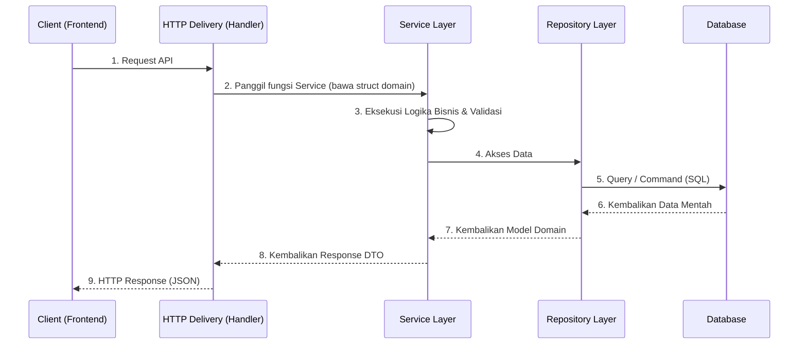
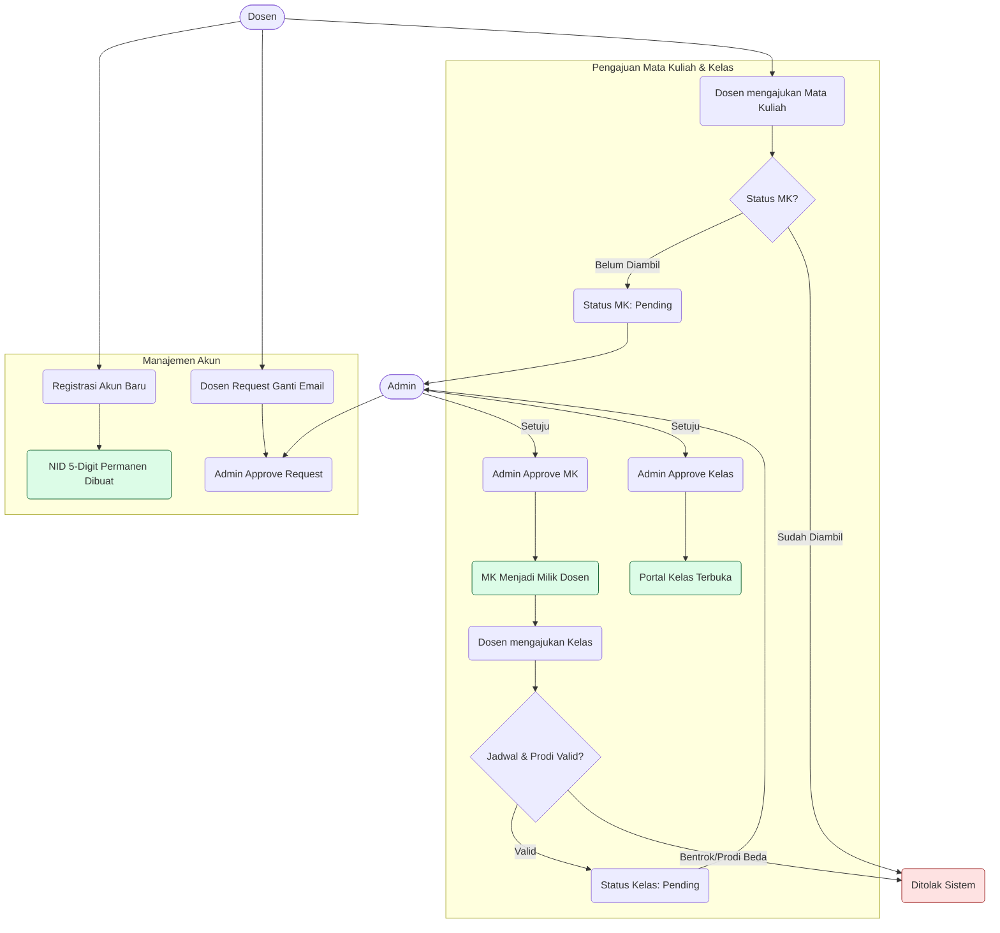

# SIAKAD Pro System

<div align="center">
  
  
  
  
</div>

<br/>

Sebuah sistem informasi akademik terintegrasi (SIAKAD Pro) yang dikembangkan dengan fokus pada performa tinggi, struktur kode yang bersih (*Clean Architecture*), serta desain antarmuka modern (*Glassmorphism*).

> **Visi Proyek**: Mewujudkan infrastruktur sistem akademik yang *scalable*, aman, dan memberikan *user experience* terbaik melalui adaptasi teknologi Svelte 5 Runes dan kapabilitas tinggi Go Fiber.

---

## 📑 Daftar Isi
1. [Fitur Utama](#-fitur-utama)
2. [Teknologi & Kualitas](#-teknologi--kualitas)
3. [Arsitektur Sistem](#-arsitektur-sistem)
4. [Struktur Proyek](#-struktur-proyek)
5. [Instalasi & Penggunaan](#-instalasi--penggunaan)
6. [Alur Bisnis](#-alur-bisnis)

---

## 🚀 Fitur Utama

### 1. Manajemen Institusi Terpusat
- **Manajemen Kelas Dinamis**: Mendukung jadwal *multi-schedule* dengan proteksi *conflict* (bentrok jadwal) secara *real-time*.
- **Portal Kelas & Sistem Absensi**: Dilengkapi **Manajemen Pertemuan Terpusat** (auto-increment pertemuan hingga maksimal 16), pembuatan **Kode Absensi 6-digit** dinamis, dan terintegrasi dengan **Rekap Kehadiran Mahasiswa**.
- **Sistem Pengajuan Berjenjang**: Dosen mengajukan kelas dan mata kuliah, kemudian Admin melakukan *review* (Approve/Reject).

### 2. Arsitektur & Keamanan
- **Single Source of Truth**: Logika bisnis (seperti Absensi & Pertemuan) dipusatkan secara eksklusif agar riwayat database selalu konsisten tanpa redundansi.
- **Modern Authentication (RBAC)**: Autentikasi JWT yang kuat untuk segregasi akses antara Admin, Dosen, dan Mahasiswa.
- **Data Integrity**: Memanfaatkan *transactional operation* (ACID) pada PostgreSQL untuk mencegah anomali saat pemrosesan lintas tabel.

### 3. User Experience (UX)
- **Role-based Dashboards**: Tampilan adaptif dengan tata letak grid, navigasi *Glassmorphism*, dan transisi instan tanpa *reload*.
- **Real-time Evaluasi**: Admin memiliki dasbor analitik untuk melihat utilitas akademik (misal: Mata Kuliah kosong, Dosen tanpa jadwal).
- **Notifikasi Pintar**: *Toast Notification* global berbasis *state* yang interaktif dan informatif.

---

## 🛠️ Teknologi & Kualitas

Sistem ini dibangun dengan memprioritaskan kebutuhan non-fungsional (*Non-Functional Requirements*).

| Komponen | Teknologi | Fokus Kualitas (*Quality Attributes*) |
| :--- | :--- | :--- |
| **Backend** | Go, Fiber (v2) | **Performance**: Eksekusi HTTP ultra-cepat, penggunaan (*footprint*) memori sangat rendah. |
| **Frontend** | Svelte 5 (Runes), Vite | **Usability**: UI reaktif dan efisien tanpa *overhead Virtual DOM*. |
| **Database** | PostgreSQL, GORM | **Data Integrity**: Skema selalu konsisten dengan fitur *Auto-Migrate*. |
| **Caching** | Redis | **Scalability**: Penyimpanan sesi dan token sementara berkecepatan tinggi. |
| **Keamanan** | JWT, Bcrypt | **Security**: Interaksi API *stateless* yang ketat dengan aturan *Role-Based Access*. |

---

## 🏗️ Arsitektur Sistem

Sistem ini menerapkan pola **Clean Architecture** pada Backend (Domain, Repository, Service, Delivery). Lapisan logika bisnis (Service) terisolasi penuh dari infrastruktur (Repository).

<details>
<summary><b>Lihat Diagram Arsitektur (Data Flow)</b></summary>


</details>

---

## 📂 Struktur Proyek

Seluruh komponen disusun agar mudah dikembangkan dan dimodifikasi (*Maintainability* tinggi).

<details>
<summary><b>Jelajahi Hierarki Direktori Utama</b></summary>

```text
📦 Project Root
 ┣ 📂 cmd/api              # Main entry point aplikasi Go
 ┣ 📂 config               # Konfigurasi environment (DB, Redis, JWT)
 ┣ 📂 docs                 # Dokumentasi auto-generated (Swagger)
 ┣ 📂 frontend             # Direktori frontend SvelteKit
 ┃  ┣ 📂 src/lib
 ┃  ┃  ┣ 📂 components     # Dashboard, Splash, UI Reusable (Card, Modal, Badge)
 ┃  ┃  ┣ 📂 services       # API Service layer untuk fetch data
 ┃  ┃  ┗ 📂 stores         # Global State Svelte 5 Runes (auth, toast)
 ┃  ┣ 📂 src/routes        # Halaman Aplikasi berbasis File-system Routing
 ┃  ┗ 📜 app.css           # File core CSS dengan variable desain
 ┣ 📂 internal             # Core logic dari backend SIAKAD Pro
 ┃  ┣ 📂 app               # Registrasi aplikasi dan middleware (Fiber)
 ┃  ┣ 📂 modules           # Modul domain (auth, kelas, matakuliah, programstudi)
 ┃  ┗ 📂 shared            # Logic shared (DB, Cache, Error Handler, Response)
```
</details>

---

## 💻 Instalasi & Penggunaan

### 1. Persyaratan Sistem
Pastikan sistem Anda telah memiliki instalasi:
- **Go** (v1.20+)
- **Node.js** (v18+)
- **PostgreSQL** (berjalan pada port `5432`)
- **Redis** (berjalan pada port `6379`)

### 2. Konfigurasi & Menjalankan Backend
Buat file konfigurasi `.env` di direktori utama (Root):
```env
PORT=8080
ENV=development

DB_HOST=localhost
DB_PORT=5432
DB_USER=postgres
DB_PASSWORD=postgres
DB_NAME=postgres
DB_SSLMODE=disable

REDIS_HOST=localhost
REDIS_PORT=6379
REDIS_PASSWORD=
REDIS_DB=0

JWT_SECRET=supersecret-jwt-key
```

Lalu nyalakan server *Backend*:
```bash
go run cmd/api/main.go
# Server berjalan di: http://localhost:8080
# Dokumentasi Swagger: http://localhost:8080/api/v1/swagger/
```

### 3. Menjalankan Frontend
Buka terminal/konsol baru, navigasi ke direktori frontend, instal dependensi, lalu jalankan:
```bash
cd frontend
npm install
npm run dev
# Frontend berjalan di: http://localhost:5173
```

---

## ⚖️ Alur Bisnis

Berikut adalah alur operasional utama SIAKAD Pro mulai dari registrasi dosen hingga pengelolaan sesi kelas.

<details>
<summary><b>Lihat Diagram Flowchart Aturan Bisnis</b></summary>


</details>

---
*Dikembangkan untuk arsitektur modern web dengan standar kebersihan kode dan fungsionalitas akademik tinggi.*
